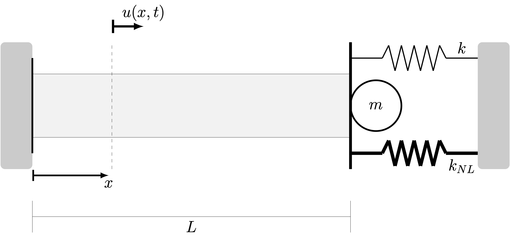

## Random Dynamics of a Bar System

**RandBar: Random Dynamics of a Bar System** is a powerful Matlab tool designed to simulate the nonlinear stochastic dynamics of a bar structural system with attached discrete elements. The code is developed with an educational approach, making it user-friendly and intuitive.

<p align="center">

</p>

### Table of Contents
- [Overview](#overview)
- [Features](#features)
- [Usage](#usage)
- [Documentation](#documentation)
- [Authors](#authors)
- [Citing RandBar](#citing-randbar)
- [License](#license)
- [Institutional Support](#institutional-support)
- [Funding](#funding)

### Overview
**RandBar** was developed to conduct stochastic simulations of a bar structural system with attached discrete elements. The results have been published in a peer-reviewed journal:
- **A. Cunha Jr, R. Sampaio**, *On the nonlinear stochastic dynamics of a continuous system with discrete attached elements*, Applied Mathematical Modelling, 39, pp. 809-819, 2015. [DOI](http://dx.doi.org/10.1016/j.apm.2014.07.012)

### Features
- Simulates nonlinear stochastic dynamics of bar systems
- Intuitive Matlab implementation
- Educationally styled code for easy understanding

### Usage
To get started with **RandBar**, follow these steps:
1. Clone the repository:
   ```bash
   git clone https://github.com/americocunhajr/RandBar.git
   ```
2. Navigate to the code directory:
   ```bash
   cd RandBar/RandBar-1.0
   ```
3. Execute:
   ```bash
   main__randbar_fixed_mass_spring__MC
   ```

### Documentation

The routines in **RandBar** are thoroughly commented to explain their functionality. Each routine includes a description of its purpose, as well as inputs and outputs.

### Authors
- Americo Cunha Jr
- Rubens Sampaio

### Citing RandBar
If you use **RandBar** in your research, please cite the following publication:
- *A. Cunha Jr, R. Sampaio, On the nonlinear stochastic dynamics of a continuous system with discrete attached elements, Applied Mathematical Modelling, v. 39, pp. 809-819, 2015 http://dx.doi.org/10.1016/j.apm.2014.07.012*

```
@article{CunhaJr2015p809,
author  = {A. {Cunha~Jr} and R. Sampaio},
title   = {On the nonlinear stochastic dynamics of a continuous system with discrete attached elements},
journal = {Applied Mathematical Modelling},
year    = {2015},
volume  = {39},
pages   = {809-819},
doi     = {http://dx.doi.org/10.1016/j.apm.2014.07.012},
}
```

### License

**RandBar** is released under the MIT license. See the LICENSE file for details. All new contributions must be made under the MIT license.

 

### Institutional support


### Funding

 &nbsp; &nbsp;  &nbsp; &nbsp; 
